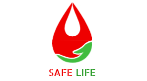

<!-- PROJECT LOGO -->
 

  cd

  

     
    <a href="#"><strong>Explore the docs »</strong></a>
     
     
    <a href="#">View Demo</a>
    ·
    <a href="#">Report Bug</a>
    ·
    <a href="#">Request Feature</a>
  

  
Table of Contents

  <ol>
    <li>
      <a href="#about-the-project">About The Project</a>
    </li>
    <li>
      <a href="#getting-started">Getting Started</a>
      <ul>
        <li><a href="#prerequisites">Prerequisites</a></li>
        <li><a href="#installation">Installation</a></li>
      </ul>
    </li>
    <li><a href="#data_structure">Data Structure</a></li>
    <li><a href="#Requirements">API Requirements</a></li>
    <li><a href="#functions">Functions Implements</a></li>
    <li><a href="#contact">Contact</a></li>
  </ol>

## About The Project

The goals of this project is to support the health system from Angola.
The project is focused in torn easy the people found other people or Institutions that have same type of Blood or organs

## Data Structure

We used the following data structure:

  

## API
https://documenter.getpostman.com/view/8651515/Tzm9kvHf

### Functions

List of functions:
* Functions in User
* Functions in Request
* Functions in Answers of Request

<!-- MARKDOWN LINKS & IMAGES -->
<!-- https://www.markdownguide.org/basic-syntax/#reference-style-links -->
